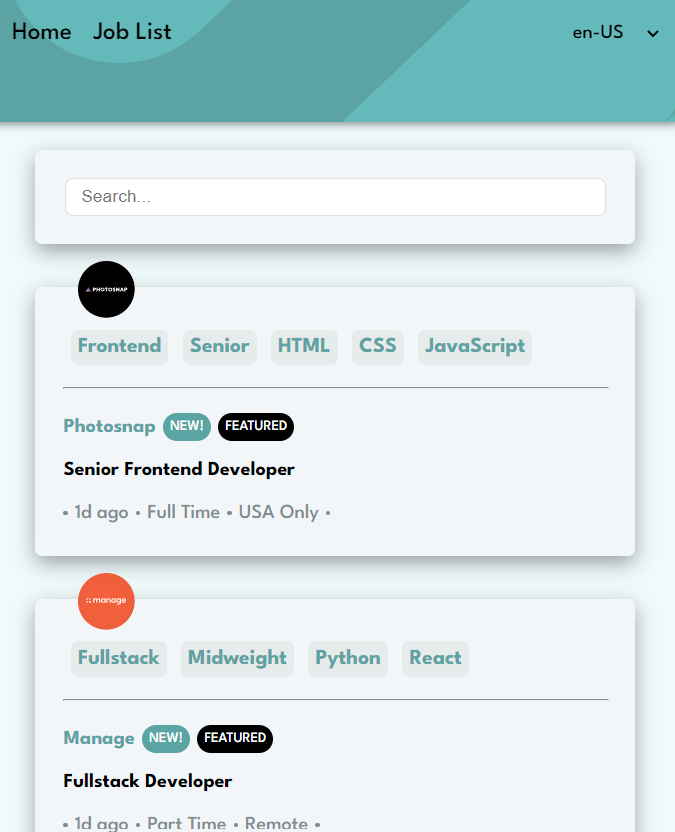
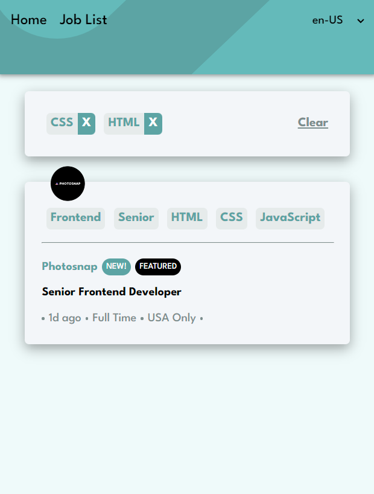

# Vue Job Listings

Gitlab repository - [vue-job-listings](https://github.com/RuslanaTomnyuk/vue-job-listings.git)

## Built with

- Semantic HTML5 markup
- SCSS(mixins, variables)
- Flexbox
- [Vue](https://vuejs.org/) - The Progressive JavaScript Framework
- [Vite](https://vitejs.dev/) - Vite Next Generation Frontend Tooling
- TypeScript

   # Table of contents

- [Screenshot](#screenshot)
- [Getting Started](#getting-started)
- [Installation](#installation)
- [Usage](#usage)
- [Development](#development)

# Screenshot

## Getting Started

To get started with the project, follow these steps:

### Installation

Environment and tools:
- Node.js (version 16 or higher)
- npm (version 6 or higher)

Project set up:
1. Clone the repository: `git clone` [vue-job-listings](https://github.com/RuslanaTomnyuk/vue-job-listings.git)
2. Navigate to the project directory: `cd vue-job-listings`.
3. Install the dependencies: `npm install`.

To start the app run `npm run dev`.

#### Usage

- to start the app use `npm run dev`
- to run eslint use `npm run eslint`, stylelint - `npm run stylelint`
- to fix eslint problems automatically use `npm run fix:lint`, stylelint - `npm run fix:stylelint`

##### Development

To run the project in development mode, use the following command:
`npm run dev`.

This will start the development server, and you can access the application at `http://localhost:5173`.
